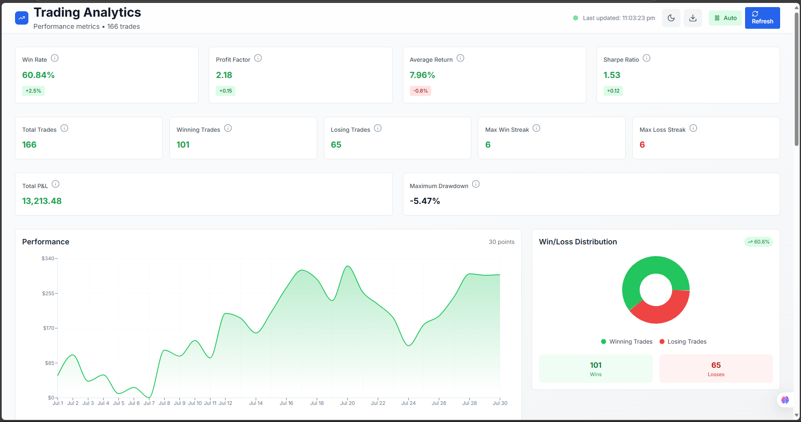
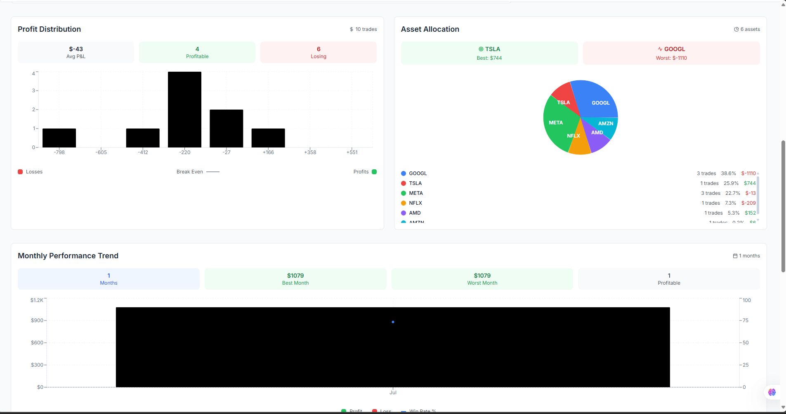
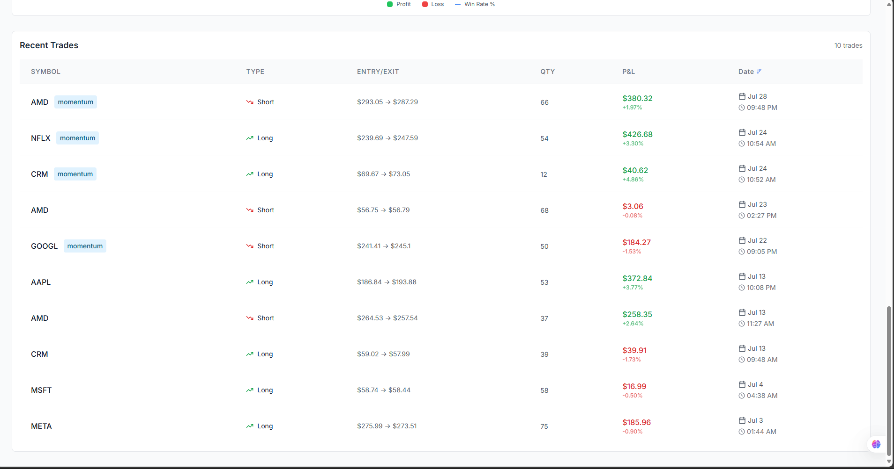
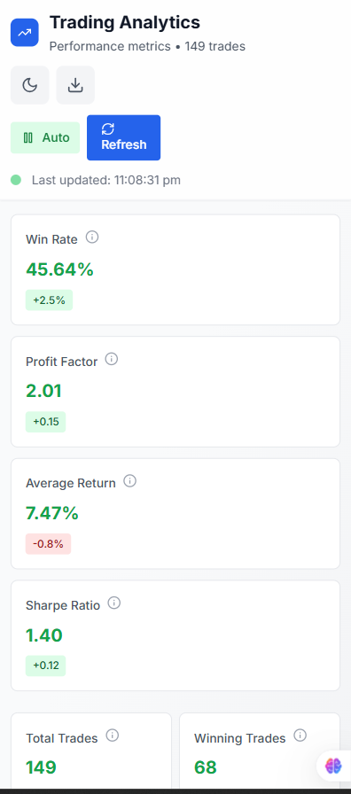

# Trading Analytics Dashboard

A modern, responsive analytics dashboard built with React and Express.js for tracking trading performance metrics and insights.

## 🚀 Live Demo

[View Live Demo](http://localhost:3000) (when running locally)

## 📁 Project Structure

```
mini-analytics-dashboard/
├── client/                 # React frontend
│   ├── src/
│   │   ├── components/    # React components
│   │   ├── hooks/         # Custom React hooks
│   │   ├── contexts/      # React contexts
│   │   ├── services/      # API services
│   │   └── utils/         # Utility functions
│   └── public/            # Static assets
├── server/                 # Express.js backend
│   ├── server.js          # Main server file
│   └── package.json       # Server dependencies
└── setup.js               # Project setup script
```

##  Tech Stack

### Frontend
- **React 18** - UI framework
- **Tailwind CSS** - Styling and responsive design
- **Recharts** - Data visualization and charts
- **Lucide React** - Icons
- **Axios** - HTTP client for API calls

### Backend
- **Express.js** - REST API server
- **CORS** - Cross-origin resource sharing
- **Nodemon** - Development server with auto-reload

##  Features

### Analytics Dashboard
- **Real-time metrics** - Win rate, profit factor, Sharpe ratio
- **Performance charts** - Cumulative P&L visualization
- **Trade analysis** - Recent trades with detailed information
- **Asset allocation** - Portfolio distribution charts
- **Profit distribution** - P&L analysis visualization

###  User Experience
- **Responsive design** - Works on all screen sizes
- **Auto-refresh** - Real-time data updates
- **Export functionality** - CSV and PDF export options
- **Keyboard shortcuts** - Quick access to features

###  Mobile Optimized
- **Touch-friendly** - Optimized for mobile devices
- **Responsive charts** - Charts adapt to screen size
- **Mobile navigation** - Intuitive mobile interface

##  Quick Start

### Prerequisites
- Node.js (v16 or higher)
- npm or yarn

### Installation

1. **Clone the repository**
   ```bash
   git clone <repository-url>
   cd mini-analytics-dashboard
   ```

2. **Run the setup script**
   ```bash
   node setup.js
   ```

3. **Start the development server**
   ```bash
   npm run dev
   ```

4. **Open your browser**
   - Frontend: http://localhost:3000
   - Backend API: http://localhost:5000

##  Setup Instructions

### Manual Setup (Alternative)

1. **Install root dependencies**
   ```bash
   npm install
   ```

2. **Install server dependencies**
   ```bash
   cd server
   npm install
   cd ..
   ```

3. **Install client dependencies**
   ```bash
   cd client
   npm install
   cd ..
   ```

4. **Start both servers**
   ```bash
   npm run dev
   ```

### Available Scripts

- `npm run dev` - Start both frontend and backend
- `npm run server` - Start only the backend
- `npm run client` - Start only the frontend
- `npm run build` - Build the frontend for production

## 🎯 Key Decisions & Architecture

### Frontend Architecture

**Component Structure**
- Used functional components with React hooks
- Implemented custom hooks for reusable logic (useZoomScale, useDateFilter)
- Separated concerns with dedicated service layer

**Styling Approach**
- Chose Tailwind CSS for rapid development and consistency
- Implemented responsive design with mobile-first approach
- Created custom utility classes for specific use cases
- Used consistent styling approach

**State Management**
- Used React's built-in state management (useState, useEffect)
- Implemented context for global state (theme, notifications)
- Created custom hooks for complex state logic
- Used proper error boundaries for error handling

### Backend Architecture

**API Design**
- RESTful API endpoints for data retrieval
- Implemented proper error handling and status codes
- Used CORS for cross-origin requests
- Created mock data generators for realistic testing

**Data Structure**
- Designed comprehensive analytics data model
- Implemented trade data with realistic fields
- Created performance metrics calculations
- Used proper data formatting and validation

### Technical Decisions

**Chart Library Choice**
- Selected Recharts for its React integration
- Implemented responsive chart containers
- Created custom tooltips and formatting
- Used proper chart accessibility features

**Responsive Design**
- Implemented mobile-first responsive design
- Created adaptive layouts for different screen sizes
- Used CSS Grid and Flexbox for layouts
- Implemented touch-friendly interactions

**Performance Optimization**
- Used React.memo for component optimization
- Implemented proper loading states
- Created efficient data fetching patterns
- Used proper error boundaries

## 🎨 Design Decisions

### Visual Design
- **Clean, professional aesthetic** - Focused on readability and usability
- **Consistent color scheme** - Used semantic colors for data visualization
- **Typography hierarchy** - Clear information architecture
- **White space utilization** - Proper spacing for better readability

### User Experience
- **Intuitive navigation** - Clear information hierarchy
- **Real-time feedback** - Loading states and notifications
- **Accessibility** - Proper ARIA labels and keyboard navigation
- **Mobile optimization** - Touch-friendly interface

### Data Visualization
- **Meaningful charts** - Each chart serves a specific purpose
- **Color coding** - Green for profits, red for losses
- **Interactive elements** - Hover states and tooltips
- **Responsive charts** - Adapt to different screen sizes

##  Development Process

### Code Organization
- **Modular components** - Each component has a single responsibility
- **Reusable hooks** - Custom hooks for common functionality
- **Service layer** - API calls separated from components
- **Utility functions** - Shared helper functions

### Testing Strategy
- **Error boundaries** - Graceful error handling
- **Loading states** - Proper user feedback
- **Data validation** - Input validation and sanitization
- **Cross-browser testing** - Compatibility across browsers

### Performance Considerations
- **Lazy loading** - Components load when needed
- **Optimized re-renders** - Proper dependency arrays
- **Efficient data fetching** - Minimal API calls
- **Bundle optimization** - Tree shaking and code splitting

## 📸 Screenshots

### Desktop Dashboard - Main View


### Desktop Dashboard - View 2


### Desktop Dashboard - View 3


### Mobile Dashboard



## 🚀 Deployment

### Frontend Deployment
```bash
cd client
npm run build
```

### Backend Deployment
```bash
cd server
npm start
```

## 🤝 Contributing

1. Fork the repository
2. Create a feature branch
3. Make your changes
4. Test thoroughly
5. Submit a pull request

## 📄 License

This project is licensed under the MIT License.

##  Acknowledgments

- React team for the amazing framework
- Tailwind CSS for the utility-first CSS framework
- Recharts for the charting library
- Lucide for the beautiful icons

---

**Built with ❤️ using React and Express.js** 